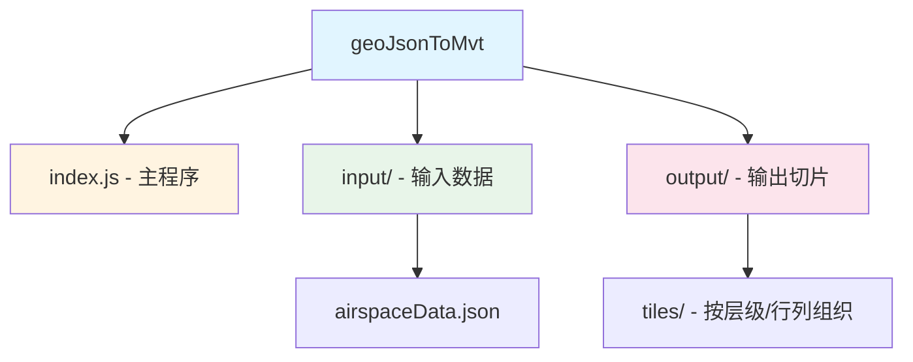

# geoJsonToMvt

## 变更记录 (Changelog)

### 2026-03-12 16:12:24
- 初始化 AI 上下文文档
- 完成项目架构分析与文档生成

---

## 项目愿景

将 GeoJSON 格式的地理空间数据转换为 Mapbox Vector Tiles (MVT) 格式，用于高效的地图切片渲染。

## 架构总览

这是一个**单模块 Node.js 工具项目**，采用简单直接的数据处理流程：

1. **输入**：从 `input/` 目录读取 GeoJSON 文件
2. **处理**：使用 `geojson-vt` 生成切片索引，使用 `vt-pbf` 编码为 Protocol Buffers 格式
3. **输出**：将切片数据按层级/行列坐标保存到 `output/tiles/` 目录

### 技术栈

- **运行时**：Node.js
- **核心依赖**：
  - `geojson-vt@^4.0.2` - GeoJSON 切片索引生成
  - `vt-pbf@^3.1.3` - MVT Protocol Buffers 编码
- **包管理器**：pnpm

### 关键配置

```javascript
{
    maxZoom: 14,          // 最大切片层级
    indexMaxZoom: 6,      // 索引层级
    indexMaxPoints: 100000,
    tolerance: 3,         // 简化容差
    extent: 4096,         // 切片尺寸
    buffer: 64,           // 缓冲区大小
    debug: 0
}
```

---

## 模块结构图



---

## 模块索引

| 模块路径 | 职责 | 语言 | 状态 |
|---------|------|------|------|
| `/` (根模块) | GeoJSON 到 MVT 转换工具 | JavaScript | ✅ 已扫描 |

---

## 运行与开发

### 安装依赖

```bash
pnpm install
```

### 运行转换

```bash
node index.js
```

### 目录结构

```
geoJsonToMvt/
├── index.js              # 主程序入口
├── package.json          # 项目配置
├── pnpm-lock.yaml        # 依赖锁定文件
├── input/                # 输入数据目录
│   └── airspaceData.json # GeoJSON 源数据
└── output/               # 输出切片目录
    └── tiles/            # 按 z/x/y 组织的切片文件
```

### 输出格式

切片文件按 `{z}/{x}/{y}.pbf` 格式存储：
- `z` - 缩放层级 (0-14)
- `x` - 列号
- `y` - 行号
- `.pbf` - Protocol Buffers 二进制格式

---

## 测试策略

**当前状态**：❌ 无测试覆盖

**建议**：
- 添加单元测试验证切片生成逻辑
- 测试边界条件（空数据、无效 GeoJSON）
- 验证输出 MVT 文件的正确性

---

## 编码规范

- 使用 ES6+ 模块语法 (`import`/`export`)
- 遵循 JavaScript Standard Style（推荐使用 `prettier` 格式化）
- 避免使用 `console.log`，使用日志库

---

## AI 使用指引

### 推荐使用场景

- 修改切片参数（maxZoom、tolerance 等）
- 添加错误处理和日志记录
- 支持批量处理多个 GeoJSON 文件
- 添加进度显示和性能统计
- 优化大文件处理性能

### 注意事项

- 当前程序会生成所有层级（0-14）的切片，对于大范围数据可能非常耗时
- 输出目录需要确保有足够的磁盘空间
- 建议添加增量生成支持，避免重复处理

---

## 常见问题 (FAQ)

### Q: 如何修改切片的最大层级？
A: 修改 `index.js` 中的 `maxZoom` 参数和循环的终止条件。

### Q: 如何处理超大 GeoJSON 文件？
A: 考虑使用流式处理或将数据分块处理，避免一次性加载到内存。

### Q: 输出的切片如何使用？
A: 可以直接用于 Mapbox GL、MapLibre GL 等支持 MVT 格式的地图库。

---

## 相关资源

- [geojson-vt 文档](https://github.com/mapbox/geojson-vt)
- [vt-pbf 文档](https://github.com/mapbox/vt-pbf)
- [Mapbox Vector Tiles 规范](https://github.com/mapbox/vector-tile-spec)
